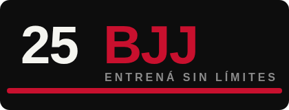

# 25 BJJ

<p align="center">
  
</p>

<h5 align="center">Entrená sin límites</h5>

**25 BJJ** es una tienda online de indumentaria y equipo para Brazilian Jiu-Jitsu, desarrollada en Django. Ofrece un catálogo real de kimonos, cinturones, rashguards y suplementos, con guía de talles, información de compra y todo lo necesario para elegir el equipo correcto antes de subir al tatami.

> Este proyecto es una adaptación (rebranding + funcionalidades nuevas) del e-commerce open source **[ByteShop](https://github.com/Nivaniz/ecommerce)**, desarrollado originalmente por **Nirvana Belén González López** como tienda genérica de electrónica. Se conservó el código base de Django y se lo transformó en una tienda temática de BJJ como Trabajo Práctico de la materia Práctica Profesional II (IPET 1308).

## ¿En qué consiste?

25 BJJ es una tienda — no una academia — pensada para practicantes de Jiu-Jitsu que buscan equipo confiable: kimonos, cinturones, rashguards y suplementos, con talles reales (A0 a A4 para kimonos y cinturones, S a XL para rashguards) y precios acordes al mercado argentino.

El proyecto está desarrollado en Django (Python), con HTML, CSS/Bootstrap y JavaScript/jQuery en el frontend, y base de datos SQLite.

## Qué se modificó respecto del proyecto original

- **Identidad de marca:** nuevo nombre, logo, favicon, banner, paleta de colores (negro, rojo y blanco) y tipografías propias (Anton + Inter), con el slogan "Entrená sin límites".
- **Catálogo:** 4 categorías (Kimonos, Cinturones, Rashguards, Suplementos) y 11 productos con fotos reales, variantes de color/talla y precios realistas.
- **Sección nueva:** página de Guía de Talles y menú desplegable "Información" (¿Quiénes somos?, Pagos, Retiros y Envíos, Cambios y Devoluciones).
- **Funcionalidad nueva:** filtro de precio funcional en el listado de la tienda y sección de "productos relacionados" en cada ficha de producto.

## Características destacadas

- **Catálogo de productos**
  - Categorías: Kimonos, Cinturones, Rashguards y Suplementos.
  - Variantes de color y talla por producto.
  - Filtro de precio funcional y productos relacionados por categoría.
- **Guía de Talles**
  - Tablas de equivalencia para elegir el talle correcto según altura, peso o contorno.
- **Información**
  - Páginas institucionales: quiénes somos, medios de pago, envíos, cambios y devoluciones.
- **Carrito de compra**
  - Cada usuario tiene su carrito identificado por un `cartID` único, con los productos seleccionados y sus variantes.
- **Cuentas de usuario**
  - Registro e inicio de sesión, verificación de cuenta por correo, edición de perfil y recuperación de contraseña.
- **Panel de administración**
  - Alta de productos y categorías, gestión de reseñas, pedidos, pagos y usuarios desde `/securelogin/`.

## Ejecución

Es necesario tener instalados los requerimientos del proyecto para poder ejecutarlo con `python manage.py runserver` desde la terminal, parado en la carpeta del proyecto. Una vez levantado el servidor, se accede desde `http://127.0.0.1:8000/`.

### Instalación

1. **Cloná el repositorio** (rama `25bjj`, que tiene la tienda ya adaptada; `main` conserva el proyecto original sin modificar):
   ```
   git clone -b 25bjj https://github.com/DeboraElisabet/ecommerce.git
   cd ecommerce
   ```
2. **Creá un entorno virtual y activalo:**
   ```
   python -m venv venv
   venv\Scripts\activate      # Windows
   source venv/bin/activate   # Linux / Mac
   ```
3. **Instalá las dependencias:**
   ```
   pip install -r requirements.txt
   ```
4. **Aplicá las migraciones:**
   ```
   python manage.py makemigrations
   python manage.py migrate
   ```
5. **Cargá el catálogo de 25 BJJ** (categorías y productos):
   ```
   python manage.py seed_25bjj
   ```
6. **Levantá el servidor:**
   ```
   python manage.py runserver
   ```

## Cómo acceder como administrador

A diferencia de un proyecto Django estándar, el panel de administración **no** está en `/admin/`, sino en:
```
http://127.0.0.1:8000/securelogin/
```
Para entrar, primero creá un superusuario desde la terminal:
```
python manage.py createsuperuser
```
y accedé con esas credenciales desde la URL de arriba.

## Notas

Por seguridad, la `SECRET_KEY` y las credenciales de correo (`EMAIL_HOST_USER` / `EMAIL_HOST_PASSWORD`) deberían moverse a variables de entorno propias antes de un despliegue real; en este proyecto quedaron con valores de desarrollo para simplificar la entrega académica.

## Ramas del repositorio

- **`main`** — proyecto original (ByteShop), sin modificaciones.
- **`25bjj`** — tienda 25 BJJ, con el rebranding, el catálogo nuevo, la sección de Información/Guía de Talles y las funcionalidades agregadas.

## Autoría

Adaptación realizada por **Débora Nonenmacher**
Basado en el proyecto original **[ByteShop](https://github.com/Nivaniz/ecommerce)**, creado por **Nirvana Belén González López** (https://codingwithnirvana.pythonanywhere.com).
